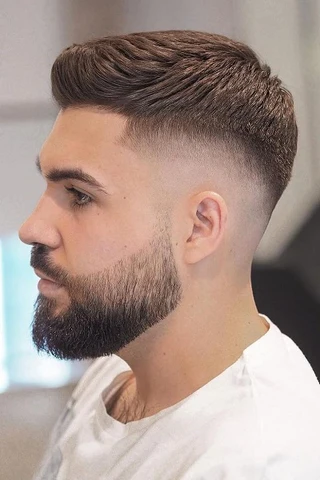
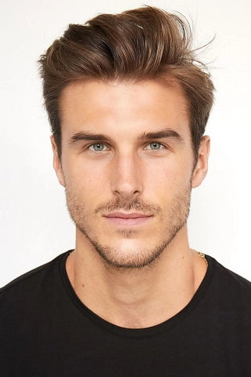
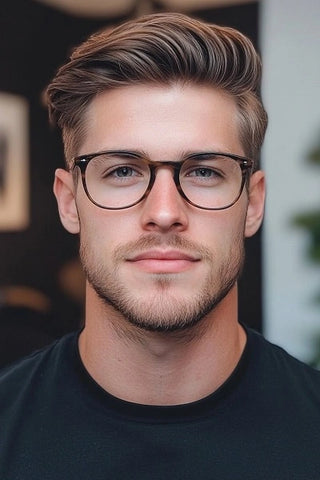
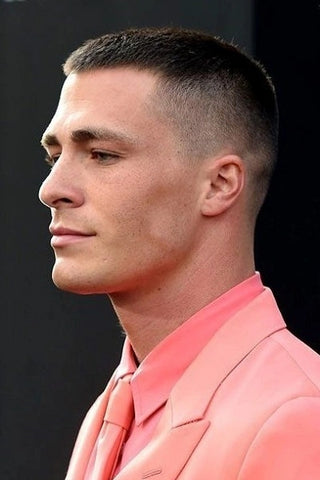

# Oval shape
**description:**  Most men with oval face shapes tend to have well-proportioned features, which means almost any hairstyle will suit you. Generally, though, you should avoid haircuts where your hair hides your forehead. Slicked-back long and mid-length hairstyles are great for oval face shapes as they draw attention to your features and keep the hair off your face.

## Hairstyles
### Undercut
**description:** For oval face shape hairstyles male, the classic undercut paired with a well groomed beard is a timeless combination that enhances their natural features. This haircut complements the balanced proportions of an oval face, making it one of the best hairstyles for oval faced men.

### Textured crop
**description:** The Textured Crop emerges as a quintessential choice for short haircuts for oval faces male among the myriad of hairstyles available. This effortlessly chic style perfectly complements the balanced proportions of an oval face, enhancing its natural symmetry. This combination not only embraces the best of oval face hairstyles but also caters to the dynamic preferences of modern men seeking a versatile and fashionable appearance. 

### Side part
**description:** The side part haircut is a stellar hairstyles for men oval face, particularly those who prefer a clean and polished look without a beard. This oval face shape hairstyles male complements the natural contours of an oval face, enhancing its balanced proportions.

### pompadour
**description:** The pompadour hairstyle is a preferable short haircuts for oval faces male is an excellent choice for men with oval faces who prefer to keep a clean shaven look. With its signature high volume at the front and shorter sides, the pompadour is the best hairstyles for oval face men that adds a stylish and timeless touch to oval face shape hairstyles for males. 

### Buzz haircut
**description:** When it comes to choosing the right hairstyle for men oval face with thin hair and an oval face shape, the buzz cut is one of the best hairstyles for oval face men which emerges as a top contender. Short haircuts for oval faces male, especially the buzz cut, offer a low maintenance option while showcasing the facial structure. 

### Caesar cut
**description:** Caesar Cut is an ideal oval face haircuts with thin hair. This classic oval face haircut features short, even layers that are textured on top, creating a neat and structured look. This short haircuts for oval faces male works particularly well for those with thin hair, as the short length adds volume and creates the appearance of thicker hair.  

